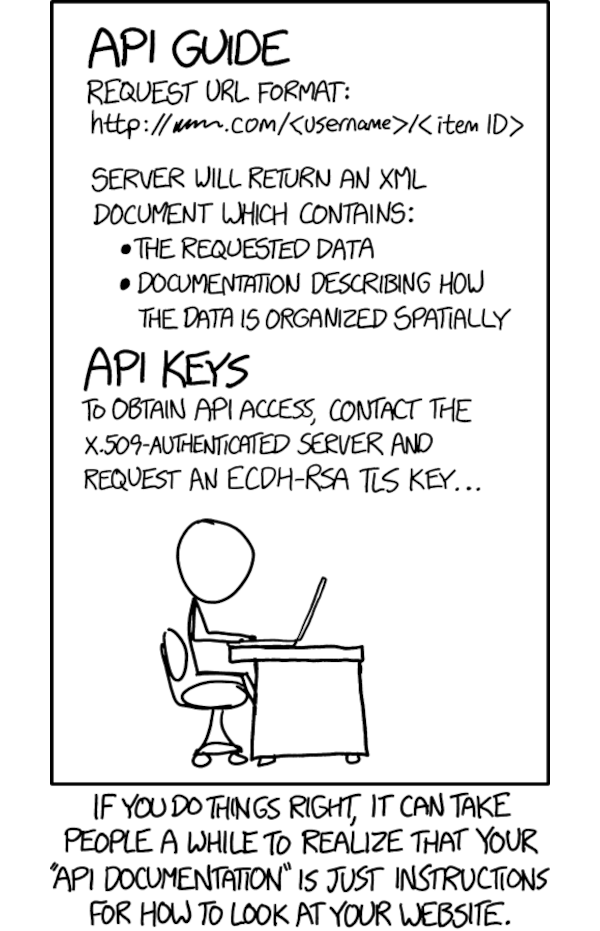

# Automated documentation

## Context

Writing an HTTP API. 

## Guides

* Use API documentation like Swagger or OpenAPI automatically provide a playground for clients.
* When Swagger or OpenAPI are not possible, make a Postman collection of sample requests for the API, with actual sample request bodies, and include a step in CI to run Postman tests against that collection. Then use the Postman Collection as external API documentation.

## Related

* [Test-Driven Development with FastAPI and Docker](https://github.com/tymyrddin/fastapi-tdd-docker)

## Resources

* [How to Document a FastAPI App with OpenAPI](https://www.linode.com/docs/guides/documenting-a-fastapi-app-with-openapi/)
* [Postman collection](https://thinkster.io/tutorials/testing-backend-apis-with-postman/using-collections-in-postman)
* [Postman tests](https://learning.postman.com/docs/writing-scripts/test-scripts/)