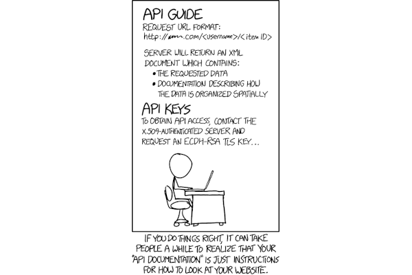

# Automated documentation

## Context

## Guides

## Related

## Resources

* [Postman collection](https://thinkster.io/tutorials/testing-backend-apis-with-postman/using-collections-in-postman)
* [Postman tests](https://learning.postman.com/docs/writing-scripts/test-scripts/)