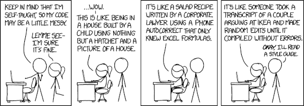

# Pull Request descriptions

## Context

Git facilitates tracking changes made to a project over time, but it does not provide the mechanism for reviewing and 
leaving inline feedback to proposed changes. So services like GitHub, GitLab, Bitbucket, and Azure DevOps build these 
layers of collaboration on top of the underlying version control software.
Whether called a merge request (GitLab) or a pull request (GitHub), this is a request to have changes merged into a 
repository or project. The process of reviewing the changes before they are merged is called "code review".

Acceptance test: A PR description should make it possible for a reviewer to take over the change set.

## Guides

* Not all pull requests are as effective at facilitating code review. The most important criterion that makes a good pull request is that it is focused.
* A reviewer can run, test, and even make experimental changes to the code.

## Related

* FastAPI TDD Docker authentication pull request

## Resources

* [Submitting Pull Requests](https://chelseatroy.com/2019/12/13/async-collaboration-1-submitting-pull-requests/)
* [Reviewing Pull Requests](https://chelseatroy.com/2019/12/18/reviewing-pull-requests/)
* [The Documentation Compendium Pull request checklist](https://github.com/kylelobo/The-Documentation-Compendium/blob/master/en/PULL_REQUEST_TEMPLATE.md)