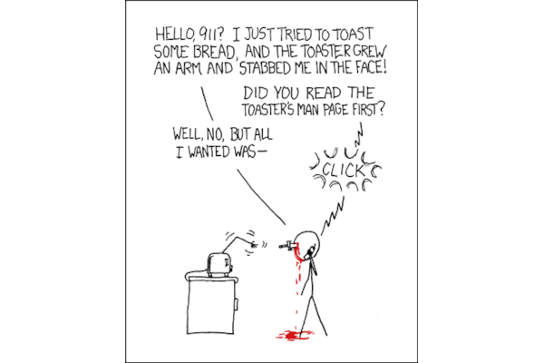

# User manuals

User manuals are on what a software does and how to use it. What follows are too many meetings, wordy emails, tiring video calls, and more confusing explanations. Key is to communicate effectively with illustrations and maybe some video recordings. Using recognisable templates with examples of the various uses of the software helps too. 

## Context

What does someone have to do to get "this" and "that", things the software is supposed to do for a user? The written communication varies from verbose to concise. Examples: [Sphinx Documentation](https://www.sphinx-doc.org/en/master/contents.html) and [The Linux man-pages project](https://www.kernel.org/doc/man-pages/).

Acceptance test: Someone new to the project, not necessarily a developer, can use the code with help of the manual.

## Guides

## Related

## Resources