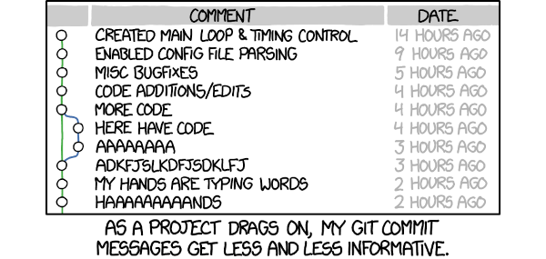

# Git commit messages

## Context

Why git commit messages are the perfect place to store contextual information about how and why a change set was made that might need further changes in the future?

* A commit message is attached to the lines where the changes were made. Most modern IDEs have a view that allows a programmer to see the message associated with the last time any given line was changed.
* When a line changes, it gets included in a new change set with a new commit message. When the code changes, the message explaining why this line is the way it is also changes.
* Even if an individual line in a file changes and gets a new message, important, older changes that may affect the whole file will still be associated with other lines in that file. A git annotation of a whole file will show relevant, timestamped, information about how this file has changed over time. 

## Guides

* Associate each commit with a single change and avoid throwing in distracting, extraneous, unrelated changes. The change can be large (like a structural refactor), but the change set should all relate to one thing then described (and if necessary, justified) in the commit message.
* Include a review of the git history in a context gathering step when approaching unknown code. Pop open the annotation view (available in most IDE's) and take a look at all the commit messages associated with a file or files which are planned to be changed.

## Related

* [FastAPI Recipes commits](https://bitbucket.org/tymyrddin/fastapi-recipes/commits/)

## Resources

* [Leveling Up Skill #6: Commit Tracing](https://chelseatroy.com/2018/07/21/leveling-up-skill-6-commit-tracing/)