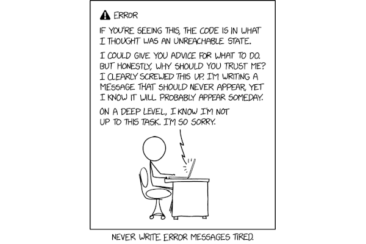

# Error messages

## Context

People set up and use software in unintended or unexpected ways (especially if the documentation is not precise and unambiguous). 
A big part of error messages is about managing pain points for others. This could be messages on misconfigurations, missing modules, or other cli messages, they can be inline errors when signing up for a product, or messages that pop up in the middle of a user’s workflow. The key is to make the interaction as smooth, painless and actionable for users as possible.

## Guides

* Keep language clear and concise
* Keep user actions specific and logical
* Avoid oops and whoops
* Avoid ambiguity
* Avoid jargon
* A sense of humour is great (we love xkcd to mock ourselves), but avoid it in error messages as it can come across as condescending
* Use a friendly tone in the wording
* Don’t blame the user. Prevent. Demonstrate precisely what is needed instead of writing something was wrong afterwards. 
* Isolate the ten most common misuses and put in time on descriptive error messages at the exact point where someone is making the mistake, thereby eliminating a solid chunk of the amount of time that people spend before they get it working. 

## Related

* [The Ten Most Ridiculous Error Messages in the History of Software](https://medium.com/swlh/the-ten-most-ridiculous-error-messages-in-the-history-of-software-4198d710ea8e)

## Resources

* [JavaScript Exception Handling: Patterns & Best Practices](https://blog.bitsrc.io/javascript-exception-handling-patterns-best-practices-f7d6fcab735d?gi=b0eb32c9a19f)
* [Python Exceptions](https://realpython.com/python-exceptions/)
