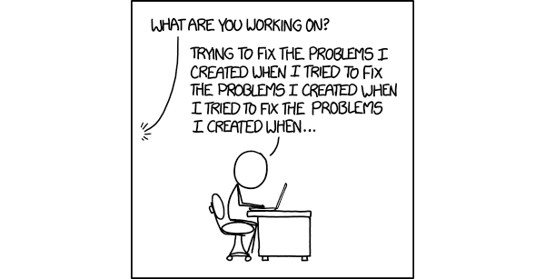

# Troubleshooting guides

## Context

Answers what the common problems are, and how to check for them? Tends to start small and grow as use of the software reveals how it might break.

## Guides

* Offer places where people can ask and report problems (forum, issue page, help desk)
* Collect enough information to replicate the issue
* Customize logs for actionable insight
* Create useful [error messages](error-messages.md) at the source-code level
* Don't mistake symptoms for root cause
* Implement a comprehensive logging infrastructure and use correlation IDs
* Use system monitors and predictive analytics
* Publish relevant resolutions and fixes in troubleshooting guides

## Related

* [A Guide to Network Troubleshooting: Basic Steps, Tips and Tools](https://www.comptia.org/content/guides/a-guide-to-network-troubleshooting)

## Resources

* [System Monitoring and Troubleshooting](https://www.rapid7.com/fundamentals/system-monitoring-and-troubleshooting/)
* [Log Analysis for System Troubleshooting](https://www.rapid7.com/blog/post/2017/03/10/log-analysis-for-system-troubleshooting/)